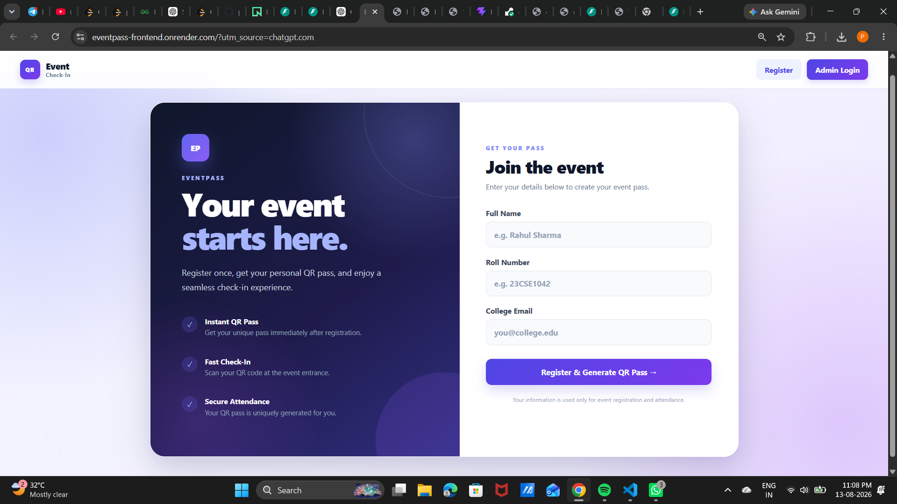
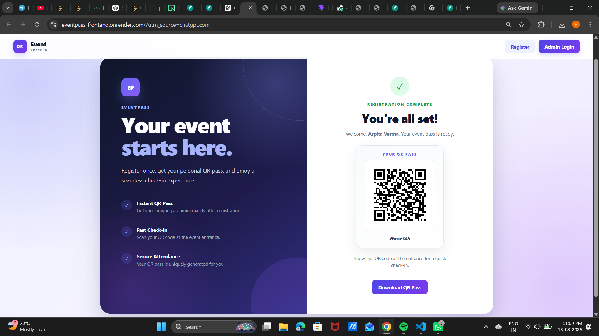
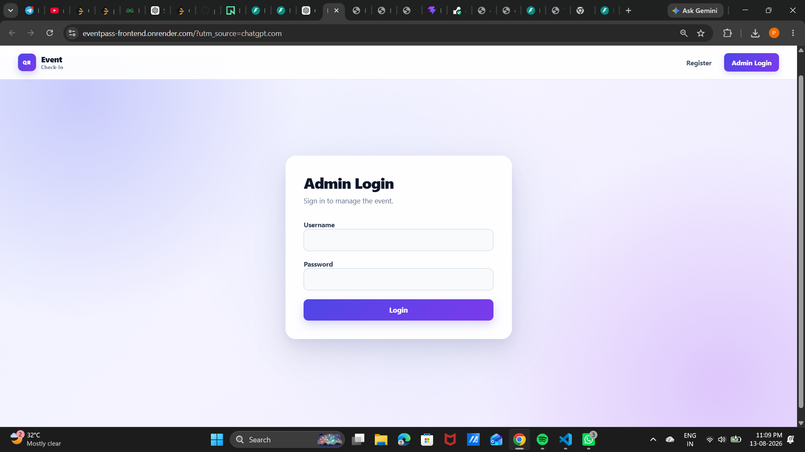
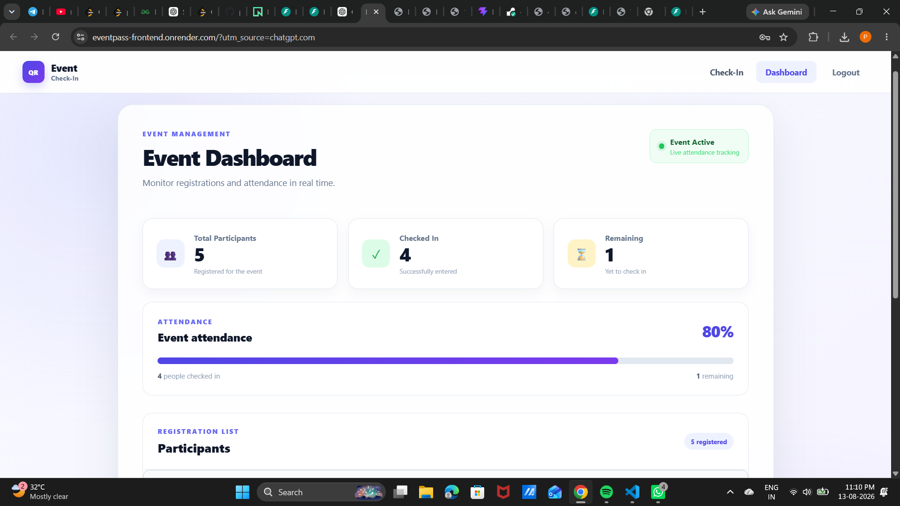
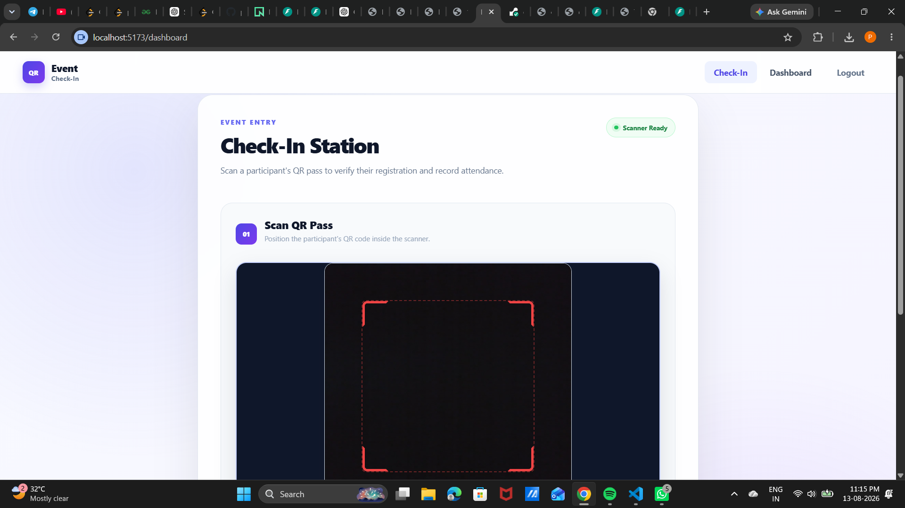
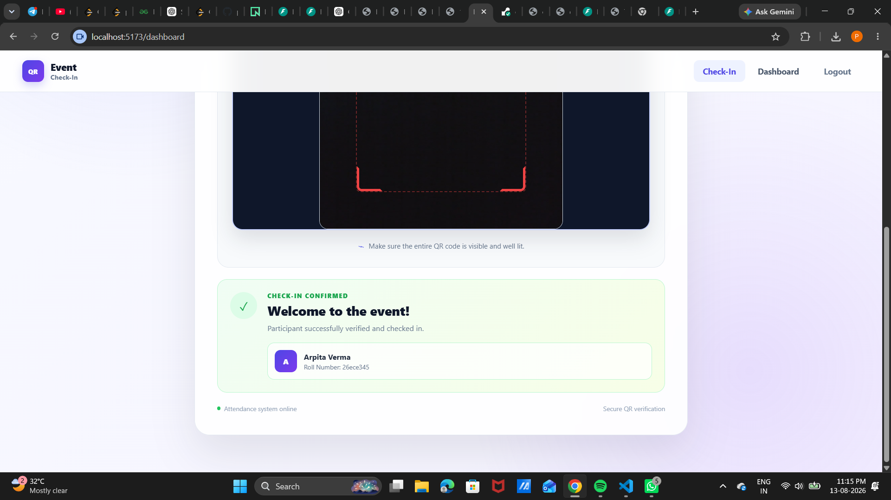

# EventPass — QR Event Check-In System

A full-stack event registration and attendance management system that lets participants register online, receive a unique QR pass, and check in at the event using a QR scanner. Admins can securely log in, monitor registrations, and track attendance in real time.

## 🚀 Live Demo

**Frontend:** https://eventpass-frontend.onrender.com

> The backend is deployed separately and connected to the frontend through an environment-based API URL.

## ✨ Features

### Participant
- 📝 Online event registration
- 🎟️ Unique QR pass generated after registration
- 📥 Downloadable QR pass
- 📱 QR pass can be presented from a phone or other device

### Admin
- 🔐 Secure admin login
- 📊 Event dashboard with attendance statistics
- 👥 View registered participants
- 🔎 Search participants by name, roll number, or email
- 🟢 Filter participants by checked-in/pending status
- 📷 QR scanner for event entry
- ✅ Duplicate/invalid QR verification handled by the backend
- 📈 Real-time attendance progress

## 🧭 Application Flow

```text
Participant
    │
    ▼
Register for Event
    │
    ▼
Backend validates & stores registration
    │
    ▼
Unique QR pass generated
    │
    ▼
Participant presents QR at entrance
    │
    ▼
Admin scans QR
    │
    ▼
Backend verifies participant
    │
    ▼
Attendance recorded
    │
    ▼
Dashboard updates
```

## 🖥️ Screenshots

### 1. Participant Registration

Participants enter their name, roll number, and college email to register for the event.



### 2. QR Pass Generation

After successful registration, the participant receives a unique QR pass that can be downloaded and presented at the entrance.



### 3. Admin Login

Event staff authenticate through the admin login before accessing event management features.



### 4. Event Dashboard

The dashboard provides an overview of total registrations, checked-in participants, remaining participants, and attendance percentage.



### 5. QR Check-In Station

Admins use the scanner to read a participant's QR pass at the event entrance.



### 6. Check-In Confirmation

A successful scan verifies the participant and records their attendance.



## 🛠️ Tech Stack

### Frontend
- React
- Vite
- JavaScript (JSX)
- CSS
- Fetch API

### Backend
- FastAPI
- Python
- SQLAlchemy
- PostgreSQL
- JWT-based admin authentication
- Argon2 password hashing

### Deployment
- Render
- GitHub

## 🔐 Security

- Admin routes require authentication.
- Admin passwords are stored using secure Argon2 hashing rather than plaintext passwords.
- Authentication tokens are used for protected admin requests.
- Frontend/backend communication is configured through environment variables.
- Secrets and environment-specific configuration are kept outside the source code.

## 📁 Project Structure

```text
qr-event-checkin/
│
├── backend/
│   ├── app/
│   │   ├── main.py
│   │   ├── models/
│   │   ├── routes/
│   │   └── ...
│   ├── requirements.txt
│   └── ...
│
├── frontend/
│   ├── src/
│   │   ├── App.jsx
│   │   ├── main.jsx
│   │   ├── index.css
│   │   └── ...
│   ├── package.json
│   └── ...
│
├── docs/
│   └── screenshots/
│
└── README.md
```

## ⚙️ Local Setup

### 1. Clone the repository

```bash
git clone <your-repository-url>
cd qr-event-checkin
```

### 2. Backend setup

```bash
cd backend
python -m venv .venv
```

Windows PowerShell:

```powershell
.venv\Scripts\Activate.ps1
```

Install dependencies:

```bash
pip install -r requirements.txt
```

Create the backend environment variables required by the project, then start the API:

```bash
uvicorn app.main:app --reload
```

### 3. Frontend setup

From the project root:

```bash
cd frontend
npm install
npm run dev
```

Set the frontend API URL in `.env`:

```env
VITE_API_URL=http://127.0.0.1:8000
```

For production, set `VITE_API_URL` to the deployed backend URL in the frontend hosting environment.

## 🧪 Production Build

To verify the frontend before deployment:

```bash
cd frontend
npm run build
```

The production build is generated in `frontend/dist`.

## 📊 What This Project Demonstrates

- Full-stack application development
- REST API integration
- Database-backed registration and attendance
- Authentication and authorization
- Password hashing and security fundamentals
- QR code generation and scanning
- Protected admin workflows
- Responsive frontend design
- Deployment of a frontend/backend application
- Git and GitHub workflow

## 🔮 Future Improvements

- Event creation and management for multiple events
- Export attendance reports as CSV/PDF
- Email delivery of QR passes
- Multiple admin roles and permissions
- Attendance timestamps and entry history
- Event-specific QR codes
- Analytics and attendance trends

## 👩‍💻 Author

**Pari Maheshwari**

Built as a full-stack project to demonstrate a practical QR-based event registration and attendance workflow.
